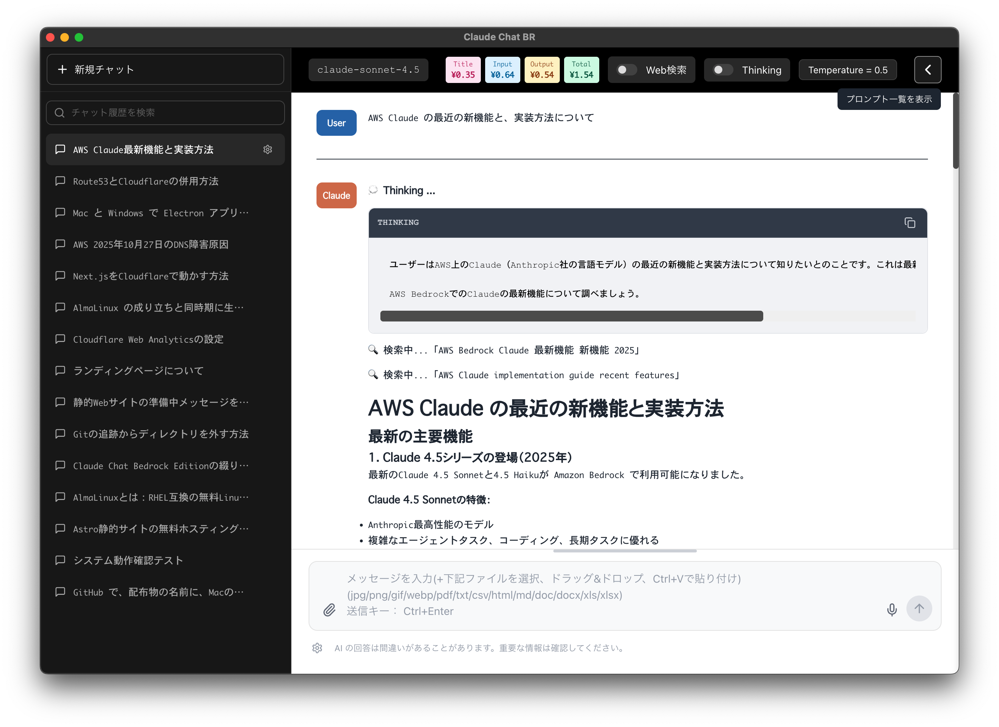

# Claude-Chat-BR
## Claude Chat Bedrock Edition

<p align="center">
  
</p>

## 概要
AWS Bedrock Claude 用デスクトップチャットアプリケーションです。
-  自分専用の Claude が使いたい。
-  使った分だけ支払いたい。
-  Web検索連動(Tavily)くらいはあった方がいい。
-  Temperature を変更したい。
-  このくらいのシンプルなのでいいんだよ。

といった、個人や小規模なチーム向けに。

<p align="center">
  
</p>

---
## 主な機能

### 🤖 チャット
- リアルタイムストリーミング応答
- 会話履歴の自動保存・管理
- 会話タイトルの自動生成

### 🔍 Web検索
- Tavily API 連携による最新情報の検索

### 📎 ファイル添付
- **画像ファイル**: PNG, JPEG, GIF, WebP（最大20個、各3.75MB）
- **ドキュメント**: PDF, Word, Excel, CSV, TXT, HTML, Markdown（最大5個、各4.5MB）
- ドラッグ&ドロップ、クリップボード貼り付け（Ctrl+V / Cmd+V）対応

### 🧠 拡張思考モード（Thinking）
- Extended Thinking 機能に対応

### 🎤 音声入力
- AWS Transcribe Streaming による音声からテキスト変換

### 💬 豊富な表示機能
- **Markdown レンダリング**: 見やすい書式表示
- **シンタックスハイライト**: コードブロックの言語別色分け
- **Mermaid 図**: フローチャート、シーケンス図などの自動描画
- **コスト表示**: チャットごとの使用料金を日本円(時価)で表示

### 🎨 カスタマイズ
- フォント・フォントサイズの変更
- 送信キーの選択（Enter / Ctrl+Enter）
- Temperature パラメータの調整
- プロンプトテンプレートの保存・管理

### 会話履歴の共有
- 会話履歴ファイルを「過去のチャット」ペインにドラッグ・アンド・ドロップで取り込み

### プロンプトの共有
- プロンプトファイルをプロンプト登録ダイアログにドラッグ・アンド・ドロップで取り込み

---
## 対応プラットフォーム

| プラットフォーム | 対応状況 | 配布形式 |
|----------------|---------|---------|
| **Windows 10/11** | ✅ | インストーラ版 / ポータブル版 |
| **macOS (Apple Silicon)** | ✅ | DMG パッケージ |

### Windows 版

#### インストーラ版（推奨）
- **ファイル名**: `Claude-Chat-BR_{バージョン番号}_windows_Setup.exe`
- **特徴**:
  - NSIS インストーラ形式
  - デスクトップ・スタートメニューにショートカット作成
  - ユーザーフォルダにデータ保存（`C:\Users\{user}\AppData\Roaming\Claude-Chat-BR\`）
  - 自動更新機能対応
  - アンインストーラ付属

#### ポータブル版
- **ファイル名**: `Claude-Chat-BR_{バージョン番号}_windows_portable.zip`
- **特徴**:
  - インストール不要、解凍して使用可能
  - 実行ファイルと同じフォルダにデータ保存
  - USB メモリなどで持ち運び可能
  - 自動更新機能なし

### Mac 版

- **ファイル名**: `Claude-Chat-BR_{バージョン番号}_macos_arm64.dmg`
- **対応 CPU**: Apple Silicon (M1 / M2 / M3 / M4)
- **特徴**:
  - DMG 形式のインストーラ
  - データ保存先: `~/Library/Application Support/Claude-Chat-BR/`
  - 自動更新機能なし

  **注意1**: Intel Mac には対応していません。
  **注意2**: 初回起動時に「"Claude-Chat-BR.app" は壊れているため開けません」というエラーが表示されます。
  #### エラーの対処方法
  このアプリは Apple の公証（notarization）を取得していないため、macOS Gatekeeper により初回起動時にブロックされます。
  エラーが表示されたら一旦キャンセルし、以下の方法を実施することで起動できます：
  **ターミナルで quarantine 属性を削除**
```Terminal
xattr -d com.apple.quarantine /Applications/Claude-Chat-BR.app
```  

- 一度上記の方法で許可すれば、以降は通常通りダブルクリックで起動できますが、  
バージョンアップ版インストール後の初回起動時も上記コマンドを実行する必用があります。  

---
## 初回設定

### AWS Bedrock の準備

アプリを使用するには、AWS アカウントと Bedrock へのアクセス権限が必要です。

#### 1. AWS アカウントの作成（未作成の場合）

[AWS 公式サイト](https://aws.amazon.com/) でアカウントを作成してください。

#### 2. IAM ユーザーの作成

1. **AWS コンソールにログイン**
   - [IAM コンソール](https://console.aws.amazon.com/iam/) にアクセス

2. **新しいユーザーを作成**
   - 左メニューから「ユーザー」を選択
   - 「ユーザーを作成」ボタンをクリック
   - ユーザー名を入力（例: `claude-chat-br-user`）
   - 「次へ」をクリック

3. **権限を設定**
   - 「ポリシーを直接アタッチ」を選択
   - 「ポリシーの作成」をクリック

4. **IAM ポリシーを作成**

   JSON タブを選択し、以下のポリシーを貼り付けます：

   **基本ポリシー（音声入力を使わない場合）:**

   ```json
   {
     "Version": "2012-10-17",
     "Statement": [
       {
         "Sid": "BedrockInvokeModel",
         "Effect": "Allow",
         "Action": [
           "bedrock:InvokeModel",
           "bedrock:InvokeModelWithResponseStream"
         ],
         "Resource": [
           "arn:aws:bedrock:*::foundation-model/*",
           "arn:aws:bedrock:*:*:inference-profile/*"
         ]
       }
     ]
   }
   ```

   **音声入力機能を使う場合:**

   ```json
   {
     "Version": "2012-10-17",
     "Statement": [
       {
         "Sid": "BedrockInvokeModel",
         "Effect": "Allow",
         "Action": [
           "bedrock:InvokeModel",
           "bedrock:InvokeModelWithResponseStream"
         ],
         "Resource": [
           "arn:aws:bedrock:*::foundation-model/*",
           "arn:aws:bedrock:*:*:inference-profile/*"
         ]
       },
       {
         "Sid": "TranscribeStreamAccess",
         "Effect": "Allow",
         "Action": [
           "transcribe:StartStreamTranscription"
         ],
         "Resource": "*"
       }
     ]
   }
   ```

   - ポリシー名を入力（例: `ClaudeChatBRPolicy`）
   - 「ポリシーの作成」をクリック

   **ポリシーの説明:**
   - `foundation-model/*`: 通常のモデル
   - `inference-profile/*`: クロスリージョン推論モデル

5. **作成したポリシーをアタッチ**
   - ユーザー作成画面に戻る
   - 検索ボックスに `ClaudeChatBRPolicy` と入力
   - 作成したポリシーにチェックを入れる
   - 「次へ」→「ユーザーの作成」をクリック

#### 3. アクセスキーの作成

1. **作成したユーザーを選択**
   - IAM コンソールの「ユーザー」から作成したユーザーをクリック

2. **アクセスキーを作成**
   - 「セキュリティ認証情報」タブを選択
   - 「アクセスキーを作成」ボタンをクリック
   - ユースケースで「ローカルコード」を選択
   - 「次へ」をクリック

3. **アクセスキーを保存**
   - **アクセスキー ID** と **シークレットアクセスキー** が表示されます
   - **必ず安全な場所に保存してください**（再表示できません）
   - `.csv ファイルをダウンロード`をクリックして保存することを推奨

#### 4. Bedrock モデルアクセスの設定
2025年9月以降、AWS Bedrock のほとんどのモデルは**自動的に有効化**されています。  
手動での有効化は不要ですが、必用な場合は下記のように設定してください。

##### Anthropic Claude モデルの初回設定

ユースケースフォームの送信：

1. **Bedrock コンソールにアクセス**
   - [Amazon Bedrock コンソール](https://console.aws.amazon.com/bedrock/) を開く
   - 使用したいリージョン（例: 東京リージョン `ap-northeast-1`）を選択

2. **モデルアクセス設定**
   - 左メニューの「Bedrock configurations」→「Model access」を選択
   - Anthropic Claude モデルを探す

3. **ユースケースフォームを送信**
   - Claude モデルの「Submit use case」ボタンをクリック
   - 使用目的などの簡単な情報を入力
   - 送信すると即座に承認されます（**承認待ちは不要**）

**注意**: このフォーム送信は**アカウントごとに1回のみ**必要です。一度送信すれば、以降は不要です。

#### 5. 利用可能なモデル ID の確認

以下は代表的なモデル ID の例です（2025年11月時点）：

| モデル名 | モデル ID | 用途 |
|---------|----------|------|
| Claude Sonnet 4.5 | `jp.anthropic.claude-sonnet-4-5-20250929-v1:0` | 高性能な会話・分析 |
| Claude Haiku 4.5 | `jp.anthropic.claude-haiku-4-5-20251001-v1:0` | 高速・低コストな応答 |

**クロスリージョン推論（日本リージョン）**: モデル ID の先頭に `jp.` が付いているものは、東京リージョン経由で推論を実行します。

最新のモデル ID は [AWS Bedrock ドキュメント](https://docs.aws.amazon.com/bedrock/latest/userguide/models-supported.html) で確認してください

### アプリの設定

初回起動時、設定ダイアログが表示されます：

1. **AWS 認証情報**
   - リージョン（例: `ap-northeast-1`）
   - アクセスキー ID
   - シークレットアクセスキー

2. **モデル設定**
   - **タイトル生成用モデル**: チャットタイトル自動生成用（例: Claude Haiku）
   - **チャット用モデル**: 会話に使用するメインモデル（例: Claude Sonnet 4.5）

3. **オプション設定**
   - プロキシ設定（企業ネットワーク環境など。環境毎に違う為、動作保証はありません）。
   - Tavily API キー（Web検索機能を使用する場合）
   - 音声入力の有効化

---
### Tavily API の設定（Web検索機能を使う場合）

**Tavily API はオプション機能です**。Web検索機能を使わない場合は設定不要です。

Tavily API を使用すると、Claude が最新のインターネット情報を検索して回答に活用できるようになります。

#### Tavily API とは

Tavily は AI 向けに最適化された検索 API サービスです。以下の特徴があります：
- リアルタイムの Web 情報を取得
- AI が理解しやすい形式で検索結果を提供
- Claude の tool use 機能と連携して自動的に検索・回答

#### API キーの取得方法

1. **Tavily アカウントの作成**
   - [Tavily 公式サイト](https://tavily.com/) にアクセス
   - 「Get Started」または「Sign Up」をクリック
   - メールアドレスでアカウントを作成

2. **API キーの取得**
   - ログイン後、ダッシュボードに API キーが表示されます
   - API キーは `tvly-` で始まる文字列です
   - 無料プランでも基本的な検索機能が利用できます

3. **アプリに設定**
   - Claude-Chat-BR の設定ダイアログ（歯車アイコン）を開く
   - 「Tavily API」セクションで以下を入力:
     - **Use Tavily**: チェックを入れる
     - **API Key**: 取得した API キー（`tvly-...`）を入力
   - 保存後、入力欄上部に「🔍 Web検索」トグルが表示されます

#### 料金について

- **無料プラン**: 月1,000リクエストまで無料
- **有料プラン**: より多くのリクエストが必要な場合は、[Tavily 料金ページ](https://tavily.com/pricing) をご確認ください

**注意**: Claude-Chat-BR アプリ自体は無料ですが、AWS Bedrock と Tavily API の使用料金は別途発生します。

---
## 基本的な使い方

### チャット開始
1. アプリを起動
2. 画面下部のテキスト入力欄にメッセージを入力
3. 送信ボタンまたは Ctrl+Enter（設定可能）で送信
4. LLM の応答がストリーミングで表示されます

### ファイル添付
- **ドラッグ&ドロップ**: ファイルを入力欄にドラッグ
- **ファイル選択**: 📎 アイコンをクリック
- **貼り付け**: 画像をコピーして Ctrl+V（Windows）/ Cmd+V（Mac）

### Web検索の利用
1. 入力欄上部の「🔍 Web検索」トグルを ON
2. 質問を送信
3. 必要に応じて最新情報を検索して回答

### 拡張思考モード
1. 入力欄上部の「🧠 Thinking」トグルを ON
2. 複雑な問題や推論が必要な質問を送信

### プロンプト管理
1. ヘッダー右端の「プロンプト」ボタンをクリック
2. よく使う質問やテンプレートを保存
3. 保存したプロンプトをクリックで入力欄に挿入

### 会話履歴
- 左サイドバーに過去のチャットを表示
- クリックで過去の会話を表示、再開可能
- 歯車アイコンから履歴の編集・削除

---
## 料金について

Claude-Chat-BR は無料のアプリケーションですが、**AWS Bedrock の API 使用料金が発生します**。

- 料金は使用したモデルとトークン数に応じて課金されます
- アプリ内でチャットごとの使用料金を日本円(時価)で表示
- 詳細は [AWS Bedrock 料金ページ](https://aws.amazon.com/bedrock/pricing/) をご確認ください

---
## よくある質問

### Q: インストーラ版とポータブル版の違いは？
A: インストーラ版は自動更新機能があり、設定データが AppData に保存されます。ポータブル版は持ち運び可能で、実行ファイルと同じフォルダにデータが保存されます。

### Q: Mac の Intel 版は使えますか？
A: Intel Mac には対応していません。Apple Silicon (M1/M2/M3/M4) 専用です。

### Q: オフラインで使用できますか？
A: いいえ、AWS Bedrock API との通信が必要なため、インターネット接続が必須です。

### Q: プロキシ環境で使用できますか？
A: はい、設定ダイアログでプロキシ設定が可能です。  
　　しかし、プロキシの設定は環境毎に違う為、動作保証はできません。

### Q: 会話データはどこに保存されますか？
A:
- **Windows インストーラ版**: `C:\Users\{user}\AppData\Roaming\Claude-Chat-BR\`
- **Windows ポータブル版**: 実行ファイルと同じフォルダ
- **Mac 版**: `~/Library/Application Support/Claude-Chat-BR/`

---
## プライバシー・セキュリティ

Claude-Chat-BR は**ユーザーのプライバシーとセキュリティを最優先**に設計されています。

### データの取り扱い

- **不正な情報収集は一切行いません**
  - ユーザーの個人情報、会話内容、使用状況などのデータを収集する機能は実装されていません
  - 使用状況の自動送信、エラーレポート送信などの機能も一切含まれていません

- **不正な外部送信は一切行いません**
  - アプリケーションが外部に送信するデータは以下の API 通信のみです：
    - **AWS Bedrock API**: ユーザーが送信したメッセージと添付ファイル（チャット機能に必要）
    - **AWS Transcribe Streaming**: 音声データ（音声入力機能を有効化した場合のみ）
    - **Tavily API**: 検索クエリ（Web検索機能を有効化し、使用した場合のみ）
    - **Yahoo Finance API**: 為替レート取得（コスト計算用、匿名）
  - 上記以外の外部サーバーへの通信は**一切行いません**

- **すべてのデータはローカルに保存されます**
  - 会話履歴、設定ファイル、プロンプトはすべて**お使いのコンピュータ内**に保存されます。
  - データは第三者のサーバーにアップロードされることはありません。

### AWS 認証情報の取り扱い

- AWS のアクセスキーとシークレットキーは**ローカルの設定ファイル**（`config.json`）にのみ保存されます
- これらの認証情報を外部に送信することはありません。

### 安全性の確認方法

1. **GitHub Releases の安全性**
   - GitHub は配布ファイルに対して基本的なマルウェアスキャンを自動実行しています
   - ただし、**ご自身でもウイルスチェックを行うことを強く推奨します**
   - Windows Defender、ウイルスバスター、ノートンなどのセキュリティソフトでスキャンしてからご使用ください

2. **ファイアウォール/ネットワークモニタリング**
   - お使いのファイアウォールやネットワーク監視ツールで、アプリケーションの通信先を確認できます
   - AWS Bedrock、AWS Transcribe、Tavily（有効化した場合）、Yahoo Finance 以外への通信が無いことを確認できます

**重要**: このアプリケーションは、ユーザーのプライバシーを尊重し、必要最低限の API 通信のみを行います。すべてのデータはユーザーのコンピュータとユーザーが設定した AWS アカウント内で管理されます。ダウンロード後は必ずウイルスチェックを実施してください。

---
## サポート・フィードバック

- **Issues**: [GitHub Issues](https://github.com/Ore2Mon2/Claude-Chat-BR/issues)

---
## ライセンス

- このソフトウェアは MIT ライセンスの下で配布されています。詳細は [LICENSE](LICENSE) をご覧ください。
- サードパーティライブラリのライセンス情報は [THIRD-PARTY-LICENSES.md](THIRD-PARTY-LICENSES.md) をご覧ください。

---
## 免責事項

このソフトウェアは**「現状のまま」（AS IS）**で提供されます。開発者は、明示的または黙示的を問わず、いかなる保証も行いません。

### 責任の制限

本ソフトウェアの使用により生じた、以下を含むがこれに限定されない、いかなる損害についても、開発者は一切の責任を負いません：

- **データの損失または破損**
- **AWS 使用料金の発生**（AWS Bedrock、AWS Transcribe などの API 使用料金）
- **セキュリティインシデント**（認証情報の漏洩、不正アクセスなど）
- **システムの障害または誤動作**
- **その他、直接的・間接的・付随的・特別・懲罰的・派生的な損害**

### 使用上の注意

- AWS 認証情報（アクセスキー・シークレットキー）は厳重に管理してください
- config.json ファイルを第三者と共有しないでください
- AWS Bedrock の使用料金は従量課金です。使用状況を定期的に確認することを推奨します
- 重要なデータは定期的にバックアップを取ることを推奨します

**本ソフトウェアの使用は、すべてユーザーの自己責任において行われるものとします。**
